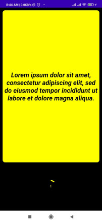

# Basis Assignment
 
This is an assignment given by getBasis in which we have to fetch some data from api and show it on a swipeable card view.

### Building the Sample App

First, clone the repo:
You can use any one of the way to do it.

1. HTTPS

        https://github.com/Barshed8974/Basis_Assignment.git

2. SSH

       git@github.com:Barshed8974/Basis_Assignment.git

3. GitHub CLI

       gh repo clone Barshed8974/Basis_Assignment

Android Studio

    Open Android Studio and select File->Open... or from the Android Launcher select Import project (Eclipse ADT, Gradle, etc.) and navigate to the root directory of your project.
    Select the directory or drill in and select the file build.gradle in the cloned repo.
    Click 'OK' to open the the project in Android Studio.
    A Gradle sync should start, but you can force a sync and build the 'app' module as needed.

Gradle (command line)

    Build the APK: ./gradlew build

Running the Sample App

Connect an Android device to your development machine.
Android Studio

    Select Run -> Run 'app' (or Debug 'app') from the menu bar
    Select the device you wish to run the app on and click 'OK'

Gradle

    Install the debug APK on your device ./gradlew installDebug
    Start the APK: 
Control

    swipe right     -> next page
    swipe left      -> previous page
    tap on progress -> restart the pages 
 
 Sample Card
 
 
 

Technologies

    Kotlin
    ViewPager
    Recycler View
    
    
    
  ## [Author](#Contributors)

- [Barshed](https://github.com/Barshed8974)
